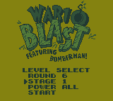
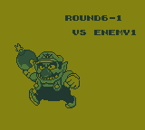
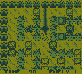

# Wario Blast - Level Select

A quality-of-life ROM hack for **Wario Blast Featuring Bomberman!** on Nintendo Game Boy.

This patch adds a full level select to the title screen while preserving the original START and PASSWORD modes. Choose any of the game's 32 normal stages, select a starting Special Item tier, then choose Wario or Bomberman through the original Player Select screen.

## Features

- Select any of the game's 32 normal stages
- Play as Wario or Bomberman
- Choose **NORMAL / NONE / KICKS / DASHIN / TROUNCER / LINER / ALL** starting Special Item tiers
- Custom POWER choices act as a starting floor; normal progression can later surpass them
- Select **ROUND EXTRA** for direct access to the original hidden THE BATTLE mode
- Original START and four-digit PASSWORD modes are preserved
- Super Game Boy functionality is preserved

## Controls

On the Level Select screen:

- **Up / Down** — Move between menu rows
- **Left / Right** — Change Round, Stage, or Power
- **A / START** — Begin when START is selected
- **B** — Return to the title screen

## Patching

Apply either the `.bps` or `.ips` patch to a clean copy of:

**Wario Blast Featuring Bomberman! (USA, Europe) (SGB Enhanced)**

BPS is recommended.

Do not apply both patches.

https://www.romhacking.net/patch/

## Source ROM

CRC32: `927B57A1`

MD5: `14FE7234EE4BCB14ADF20C743F084A35`

SHA-1: `279FB0223E362DB553B739B1B8F9C18B81D92413`

## Screenshots

| Title menu | All-item settings | Selected round | Gameplay |
| --- | --- | --- | --- |
|  |  |  |  |

## Download

See the **Releases** section for the packaged release.

## Notes

Passwords intentionally restore the original game's stock progression rather than a custom POWER setting previously chosen through Level Select. This keeps original passwords and Game Over passwords compatible with the unmodified game.

Tested extensively in SameBoy 1.0.3, on original Game Boy DMG hardware, and with Super Game Boy functionality in ares.

## Version

v1.0 — Initial release
