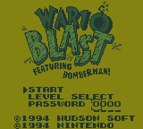

# Wario Blast - Level Select

A quality-of-life ROM hack for **Wario Blast Featuring Bomberman!** on Nintendo Game Boy.

**Version 1.0 — September 24, 2026**

This hack adds a full **LEVEL SELECT** option to the title screen while preserving the original **START** and **PASSWORD** modes. Choose any of the game's 32 normal stages, pick a starting Special Item loadout, then choose Wario or Bomberman through the original Player Select screen.

It is designed to make *Wario Blast* much easier to pick up and play without changing the normal game when you choose START or use a stock password.

## Features

- Select any of the game's **32 normal stages**
- Play as **Wario or Bomberman**
- Choose a starting permanent Special Item tier: **NORMAL / NONE / KICKS / DASHIN / TROUNCER / LINER / ALL**
- Direct access to the original hidden **THE BATTLE** mode with `ROUND EXTRA`
- Original **START** mode preserved
- Original four-digit **PASSWORD** system preserved
- Super Game Boy functionality preserved

Custom POWER choices act as a **starting floor**, not a permanent cap. If normal progression later awards a Special Item beyond the tier you selected, the game takes over normally.

## How to use

From the title screen, choose **LEVEL SELECT**.

On the Level Select screen:

- **Up / Down** — move between menu rows
- **Left / Right** — change Round, Stage, or Power
- **A / Start** on START — continue to the original Player Select screen
- **B** — return to the title screen

Choose Wario or Bomberman normally, then the selected stage begins.

Selecting **ROUND EXTRA** changes the menu to **THE BATTLE** and launches the original hidden Battle mode.

## POWER settings

| Setting | Starting Special Items |
|---|---|
| NORMAL | Whatever the original game normally provides at that stage |
| NONE | None |
| KICKS | Kicks |
| DASHIN | Kicks + Dashin |
| TROUNCER | Kicks + Dashin + The Trouncer |
| LINER | Kicks + Dashin + The Trouncer + Liner |
| ALL | All five, including Moto |

POWER only controls the permanent Special Items. Stage-specific rules remain unchanged. For example, Round 8 still uses its normal maximum Extra Bomb / Explosion Expander setup.

## Password behavior

The original password system remains stock-compatible.

Passwords intentionally restore the game's **normal stock state** for that stage, rather than a custom POWER choice previously selected through LEVEL SELECT. Game Over passwords likewise remain compatible with the original game.

## Compatibility and testing

The final build was tested extensively with the **SameBoy 1.0.3** emulation core, including all 32 stages with both Wario and Bomberman, representative POWER tiers, password entry, normal START behavior, THE BATTLE, menu stress testing, and stage-to-stage Special Item progression.

The final build was also tested on an **original Game Boy DMG**. Super Game Boy functionality was tested in **ares** and behaved as expected.

## Patching

Apply **one** of the included patches to a clean, unmodified copy of:

**Wario Blast Featuring Bomberman! (USA, Europe) (SGB Enhanced)**

BPS is recommended because it validates the source ROM. IPS is included for compatibility with older patching utilities.

Do not apply both patches, and do not patch an already modified ROM.

### Required source ROM

| | |
|---|---|
| Size | 262144 bytes |
| CRC32 | `927B57A1` |
| MD5 | `14FE7234EE4BCB14ADF20C743F084A35` |
| SHA-1 | `279FB0223E362DB553B739B1B8F9C18B81D92413` |
| SHA-256 | `1AF2D4B29552FB2CF141955E1D77F8DD99E856B1F04FBFF5240D5A1C3C2C41BF` |

### Patched v1.0 ROM

| | |
|---|---|
| Size | 262144 bytes |
| CRC32 | `698126E3` |
| MD5 | `CEC1CCDB08544D523DCF3AEFAF8D7CEC` |
| SHA-1 | `7F64DCBCE4C39EE0866120BC2E6CE13F6071FF3D` |
| SHA-256 | `6677A57DEA30284AD4AAE7A91E84BB798263BCFE78FFAD50BE6C3DA24EA7A3F9` |

## Screenshots

## Credits

Hack / release: **wavedout**

*Wario Blast Featuring Bomberman!* was developed by Hudson Soft and published by Nintendo.

This project contains **no original game ROM**.

## Changelog

### v1.0 — September 24, 2026

- Added LEVEL SELECT to the title menu
- Added access to all 32 normal stages
- Added NORMAL / NONE / KICKS / DASHIN / TROUNCER / LINER / ALL starting Special Item tiers
- Added direct access to THE BATTLE through ROUND EXTRA
- Preserved original START and PASSWORD modes
- Preserved stock password compatibility and Game Over passwords
- Added correct Wario and Bomberman sprite handling for unusual underpowered late-round starts
- Preserved Super Game Boy functionality
- Tested in SameBoy, on original DMG hardware, and with SGB functionality in ares
